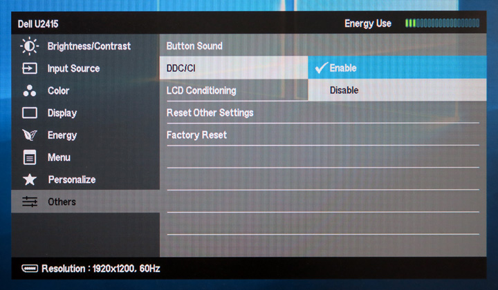

  

<h1 align="center">GameMate</h1>

GameMate is a powerful Windows application that enhance your productivity and gaming experience. It allows you to customize key bindings for different applications, add a crosshair overlay, block accidental key presses, track your time efficiently, set custom brightness for each app and automate complex sequences of actions.

## Features

Key Bindings/Macroses

  Assign unique key bindings for each application, create complex automation sequences that go beyond simple clicks. Include mouse movements, key presses, and script executions to automate repetitive tasks in any application. For example, you can set up a series of actions for Notepad using the key '8', and configure different actions for Excel using the same key, without any interference.
  
  https://github.com/user-attachments/assets/865d2540-cb84-415b-b37a-d6ea31118188

Crosshair Overlay

  Display a crosshair in the center of the screen when a specified application(game) is active. Ensure you always have a precise aim.
  
  https://github.com/user-attachments/assets/bd4ad49d-d50b-4d55-95f3-1fa449b3f712

Accidental Key Press Blocker

  Specify a list of keys to be blocked to prevent accidental presses in each application. For instance, disable the Windows key while playing a game to avoid disruptions.

Key remapping

  Some apps doesn't allow you to override default key bindings. For example in some games you will crouch on `C` key, while in the others you will use `Ctrl`. You can easily unify it now, check example on remapping  `WASD` keys to `YGHJ`:
  
  https://github.com/user-attachments/assets/dafea1c8-a5c5-41ba-a923-618d5d2d321f

Brightness control

  Allows to set custom brightness to each application. An external monitor must have DDC/CI enabled.
  
  
  https://github.com/user-attachments/assets/93cbf688-1a25-4bdd-bbc8-22b83f841b16

Timer

  Start a timer to monitor how long some action takes.

## Download

Go to [releases](https://github.com/Pennywise007/GameMate/releases) and downloaded the latest one.

## Build

1. Run `prerequisites.bat` to load submodules and build dependencies.
2. Open `GameMate.sln` with Visual Studio and build.

## Recognitions

Special thanks to [@Chaoses-Ib](https://github.com/Chaoses-Ib) for the collaboration and amazing [IbInputSimulator](https://github.com/Chaoses-Ib/IbInputSimulator)